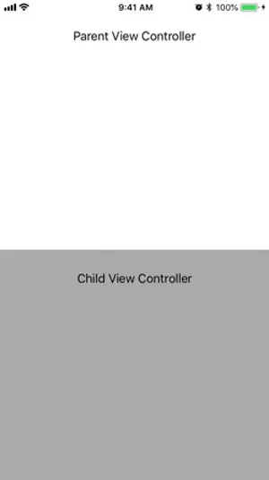

# DraggableBottomSheet

DraggableBottomSheet is a way to partially present view controllers in a way similar to Apple Maps in iOS 10. With this implementation you can interact with both view controllers that have been presented.

 

## Installation

### Manual

Just add the following files to your project 
- DraggablePresentationController.swift
- DraggableTransitionAnimator.swift
- TouchForwardingView.swift

### Cocoapods

Add the following line to your Podfile

`pod 'DraggableBottomSheet', :git => 'https://github.com/Salamander1012/DraggableBottomSheet.git', :tag => '1.0.0'`  

Then run `pod install`  

## Usage

To add a view controller as a DraggableBottomSheet your parent view controller should look like this

```
import UIKit
import DraggableBottomSheet

class YourParentViewController: UIViewController {

    private var animator: DraggableTransitionDelegate?

    override func viewDidLoad() {
        super.viewDidLoad()
        view.backgroundColor = .white
    }

    override func viewDidAppear(_ animated: Bool) {
        let bottomSheetVC = YourChildViewController()
        animator = DraggableTransitionDelegate(viewControllerToPresent: bottomSheetVC, presentingViewController: self)
        bottomSheetVC.transitioningDelegate = animator
        bottomSheetVC.modalPresentationStyle = .custom

        present(bottomSheetVC, animated: true) {
            print("completed Presentation")
        }
    }
}

```
